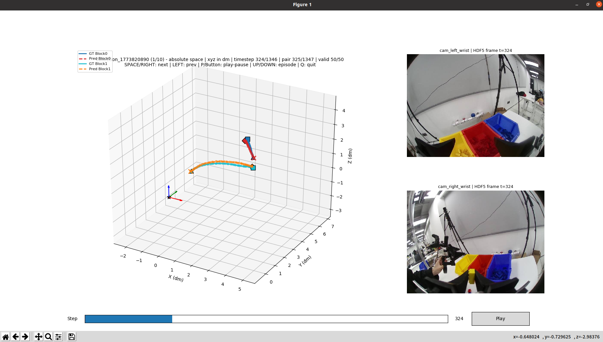
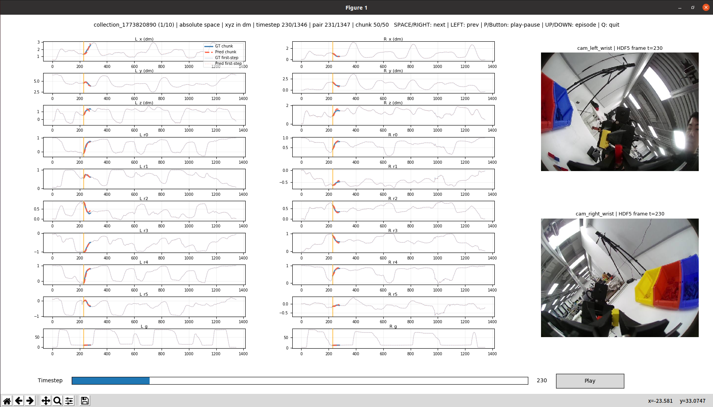

# offline-inference  离线推理项目说明

更新时间：2026-05-20

这份文档不是使用手册，而是从工程实现角度说明 `offline-inference-easy-mirro` 这个项目是怎么被做出来的：它的核心技术逻辑、数据流、关键处理、内部中间状态、SE3 action 构造、checkpoint 对齐、以及 3D/波形/HDF5 图像可视化是如何串起来的。

如果要看怎么运行命令、怎么指定 checkpoint、怎么生成图，请看 `离线推理readme.md`。本文重点解释项目本身的技术设计。
（easy-mirro为pi0版本，  pi05为lerobot版的pi05版本，输出支持相对输出和绝对输出的比较与展示）

## 1. 项目本质

这个项目本质上是一个 **Pi0 / Easy-MIRRO checkpoint 的离线评估与诊断系统**。

它不是训练系统，也不是在线控制系统。它处在训练和真实上机之间，主要解决两个问题：

1. **模型是否在离线数据分布内学到了正确的动作预测。**
2. **离线评估逻辑是否严格复现训练时的数据契约。**

项目的核心不是简单地“调用模型输出 action”，而是建立一个可检查的数据链路：

```text
checkpoint + dataset_stats + config
          +
processed HDF5 episodes
          |
          v
逐帧 observation/state/image 构造
          |
          v
Pi0 模型输出未来 50 步 action chunk
          |
          v
按训练契约构造 ground truth chunk
          |
          v
保存 trajectory_pairs / metadata / metrics
          |
          v
3D 轨迹、波形、HDF5 当前帧图像联合可视化
```

这里最重要的工程目标是：**让每一个输入 state、模型输出、ground truth、图像帧、误差指标都能追溯到同一个 timestep。**


### **1.2离线推理展示：**

##### 1.2.1 3Dxyz位姿预测与groundtruth图




##### 1.2.2  10Daction预测与groundtruth波形图



## 2. 设计目标

项目设计时主要围绕以下几个目标：

### 2.1 与训练逻辑对齐

离线评估必须和训练时的数据表达一致，否则指标没有意义。

因此代码中明确处理：

- checkpoint 的 `config.json`
- checkpoint 对应的 `dataset_stats.pkl`
- HDF5 `/observations/qpos`
- HDF5 `/action`
- checkpoint 训练时使用的 camera list
- checkpoint 训练时的 `action_mode`
- checkpoint 训练时的 `state_mode`

如果这些信息不一致，程序倾向于报错，而不是静默继续跑。

### 2.2 checkpoint 自描述

评估器默认不让用户手动指定太多模型细节，而是从 checkpoint 自己的配置里读：

```text
image_features -> camera_names
action_mode    -> delta / absolute
state_mode     -> absolute / zero_pose_gripper / zero_pose_keep_gripper
action_dim     -> 10D / 20D
chunk_size     -> 50
```

这样可以避免三相机模型被错误地按双相机评估，也可以避免 delta 输出被当作 absolute 输出比较。

### 2.3 中间状态可落盘

项目不是只输出一个 MSE，而是把逐帧结果完整保存到 `trajectory_pairs.pkl`。

这样后续可视化、debug、复查都可以基于同一个中间结果，不需要重新跑模型。

### 2.4 可视化不是附属功能，而是诊断核心

机械臂动作任务里，单个总 MSE 很容易误导。比如 gripper 数值范围大，会主导总 MSE；delta 空间和 absolute 空间尺度不同，也不能直接比较。

所以项目把可视化设计成核心诊断链路：

- 3D xyz 轨迹看空间动作是否合理。
- 波形图看每个 action 维度是否平滑、是否偏移、是否跳变。
- HDF5 当前帧图像看模型输入时机器人/人手到底在做什么。

## 3. 工程分层

项目可以分成 6 层。

```text
Shell wrapper 层
  run_eval_easy_mirro.sh
  run_eval_blackboard.sh

核心评估层
  eval_easy_mirro.py

SE3 / action 表达层
  rot6d_to_mat
  pose9d_to_se3
  compute_action_delta
  delta_chunk_to_absolute

中间结果层
  trajectory_pairs.pkl
  metadata.json
  metrics.json
  summary.txt

图像读取层
  image_frame_source.py

可视化层
  render_preview.py
  visualize_episode.py
  visualize_waveform.py
```

各层之间通过明确的数据结构连接，而不是互相临时调用内部状态。

## 4. 输入数据契约

项目的输入有两类。

### 4.1 checkpoint 输入

checkpoint 提供：

```text
模型权重
config.json
dataset_stats.pkl
```

其中 `config.json` 决定模型结构和输入输出契约，`dataset_stats.pkl` 决定归一化和反归一化尺度。

核心原则是：**离线推理只使用 checkpoint 自己的统计量，不用评估数据重新计算统计量。**

这是因为模型训练时见到的是 normalized state/action，如果离线阶段换了 stats，模型输出会被错误缩放。

### 4.2 HDF5 输入

严格评估要求 HDF5 已经是训练布局：

```text
/observations/qpos
/action
/observations/images/<camera>
```

`qpos` 是每一帧的当前绝对 state，`action` 是对应训练目标中的 future action 表达。图像是当前 timestep 的视觉 observation。

项目不鼓励在评估阶段临时从 raw 数据重建 qpos/action，因为这会把训练预处理逻辑复制到评估里，容易产生微小但致命的不一致。

## 5. checkpoint 解析流程

核心代码在 `eval_easy_mirro.py`。

大致流程是：

```text
resolve_checkpoint()
  找到真实 checkpoint 目录
  支持 checkpoint root 自动选择 checkpoint-*

load_checkpoint_config()
  读取 config.json

read_stats()
  读取 dataset_stats.pkl
  检查 NaN / Inf

resolve_camera_names()
  从 image_features 解析模型需要的相机

resolve_action_mode()
  从 config/stats 判断 delta 或 absolute

resolve_state_mode()
  从 config/stats 判断 state 输入模式

build_model()
  把 easy-mirro 训练工程加入 PYTHONPATH
  注册 MIRRO/Pi0 模型
  加载权重、config 和 normalization
```

这个阶段的关键点不是“能把模型 load 起来”，而是 **把模型训练时的隐含约束显式恢复出来**。

例如三相机 checkpoint 的 `image_features` 里会写：

```text
observation.images.cam_high
observation.images.cam_left_wrist
observation.images.cam_right_wrist
```

评估器解析后得到：

```text
cam_high, cam_left_wrist, cam_right_wrist
```

后续 HDF5 中必须存在这些相机，否则直接报错。

## 6. episode 加载流程

episode 加载由 `load_episode()` 完成。

它负责把 HDF5 文件变成模型推理需要的内存结构：

```python
{
    "images": dict[str, np.ndarray],
    "qpos": np.ndarray,
    "model_qpos": np.ndarray,
    "actions": np.ndarray,
    "episode_len": int,
    "task": str,
    "state_source": str,
    "transform_metadata": dict,
}
```

加载时会做几个关键处理。

### 6.1 qpos/action 对齐

读取：

```text
/observations/qpos
/action
```

然后截断到相同长度：

```text
episode_len = min(len(qpos), len(action))
```

这保证每个 timestep 都有：

```text
当前输入 state: qpos[t]
未来监督目标: action[t:t+50]
```

### 6.2 维度裁剪

checkpoint 会给出模型期望的 `state_dim` / `action_dim`。

加载时会检查 HDF5 维度是否足够，然后裁剪：

```text
qpos    = qpos[:, :state_dim]
actions = actions[:, :action_dim]
```

这使同一套代码可以兼容：

- 双手 20D
- 单手 10D

### 6.3 state_mode 转换

`state_for_model()` 负责把 HDF5 中的 qpos 转换成实际送入模型的 state。

当前支持：

```text
absolute:
  直接使用 /observations/qpos[t]

zero_pose_gripper:
  xyz/rot6d 清零，但保留 gripper

zero_pose_keep_gripper:
  zero_pose_gripper 的旧别名，内部 canonical 到同一套逻辑
```

这一步是为了兼容一些训练时隐藏机械臂绝对位姿、只保留夹爪状态的 checkpoint。

这里有一个容易误解的点：`zero_pose_gripper` 不是 20D 全部置零。它按 10D pose block 处理：

```text
block[0:3] xyz     -> 0
block[3:9] rot6d   -> 0
block[9]   gripper -> 保留 qpos 的绝对夹爪值
```

双手 20D 时保留的是第 9 维和第 19 维。训练脚本 `train_pi0_zero_pose_gripper_delta_mixed.sh` 的说明也是：

```text
State input: xyz/rot6d = 0, grippers = absolute
Action target: SE3 delta, grippers = absolute
```

评估器把 `zero_pose_gripper` 和 `zero_pose_keep_gripper` 作为同一类状态变换处理，是为了兼容不同训练工程中使用过的命名。但在 metadata/summary 中仍记录 checkpoint 原始 `state_mode` 字符串，方便追溯。

注意：这个转换只影响送入模型的 observation state 和 checkpoint qpos stats 归一化。后面构造 SE3 delta GT 时仍然使用 HDF5 中真实的 `/observations/qpos[t]`，不能用清零后的 state 替代真实当前位姿。

### 6.4 图像解码

图像可能是：

- HDF5 中直接保存的数组
- 压缩图像 bytes
- channel-first 数组
- BGRA 图像

`decode_image()` 会把它们统一成模型可用的 `uint8 HWC` 图像。

推理阶段会进一步转换成：

```text
float32 / bfloat16
0-1 范围
NCHW
可选 95% center crop
```

## 7. SE3 action 表达层

这个项目最核心的技术点之一，是 **delta action 不是简单减法，而是 SE3 相对变换**。

每个 10D pose block 表示：

```text
xyz(3) + rot6d(6) + gripper(1)
```

其中：

- `xyz + rot6d` 组成位姿。
- `gripper` 是独立控制量。

### 7.1 rot6d 到旋转矩阵

`rot6d_to_mat()` 把 6D rotation representation 转成 3x3 旋转矩阵。

这个表示常用于神经网络回归，因为它比四元数或欧拉角更连续。

### 7.2 pose block 到 SE3

`pose9d_to_se3()` 把：

```text
xyz + rot6d
```

转成：

```text
4x4 SE3 matrix
```

也就是：

```text
T = [R t]
    [0 1]
```

### 7.3 delta action 构造

delta checkpoint 的 ground truth 是：

```text
T_delta[t, k] = inv(T_qpos[t]) @ T_action[t + k]
```

代码入口是：

```text
compute_action_delta(qpos_vec, action_seq)
```

这里的含义是：当前 state 作为局部坐标原点，未来 action 表示为相对于当前 state 的相对运动。

这和简单相减完全不同：

```text
错误：action[t+k] - qpos[t]
正确：inv(T_qpos[t]) @ T_action[t+k]
```

### 7.4 gripper 的处理

gripper 不属于 SE3 位姿，所以不做矩阵相对变换。

当前逻辑是：

```text
delta block 中的 gripper = future action 中的绝对 gripper 值
```

这是为了和训练时的数据构造保持一致。

### 7.5 多 pose block 兼容

代码按 10D block 循环处理：

```text
10D -> 单手
20D -> 双手
30D/40D -> 理论上也可以按多个 block 处理
```

这就是为什么同一份 delta/absolute/可视化代码可以同时支持黑板单手任务和双手任务。

## 8. 模型推理 pipeline

核心函数是：

```text
run_batched_inference()
```

它对 episode 中每一帧做 batched inference。

### 8.1 state 准备

Pi0 模型内部通常有固定最大 state 维度，例如 32D。

真实任务可能是：

```text
10D 单手
20D 双手
```

所以 state 进入模型前会 pad：

```text
pad_vector(model_qpos[t], max_state_dim=32)
```

前面是真实 state，后面补 0。

这里的 `model_qpos[t]` 不是永远等于原始 qpos。它先经过 `state_for_model()`：

```text
absolute checkpoint:
  model_qpos[t] = qpos[t]

zero_pose_gripper checkpoint:
  model_qpos[t] = zero xyz/rot6d + absolute gripper
```

但 episode 中仍然保留原始 `qpos[t]`。后续 delta GT 和 delta-to-absolute reconstruction 都使用原始 qpos，而不是 `model_qpos`。这样能同时满足两个要求：

- 模型输入严格复现训练时的 state_mode。
- 动作监督和绝对轨迹重建仍然基于真实机械臂当前位姿。

### 8.2 batch 构造

每个 batch 大致包含：

```python
{
    "observation.state": states_tensor,
    "observation.images.<camera>": image_tensor,
    "task": [language_instruction] * batch_size,
    "reasoning": None,
    "is_s1": True,
    "is_vl_data": False,
    "generate_reasoning": False,
}
```

注意图像 key 必须和 checkpoint 的 `image_features` 对齐。

### 8.3 模型内部预处理

推理时调用训练工程模型自己的方法：

```text
model.normalize_inputs()
model.prepare_images()
model.prepare_state()
model.prepare_language()
model.model.sample_actions()
model.normalize_targets.unnormalize()
```

这样能保证离线推理和训练/在线推理共用同一套 normalization 和模型 wrapper。

### 8.4 输出形状

模型输出最终整理成：

```text
pred_chunks.shape = (episode_len, chunk_size, action_dim)
```

例如双手任务：

```text
(880, 50, 20)
```

单手任务：

```text
(727, 50, 10)
```

这里第一个维度的每一项都对应一个输入 timestep。

## 9. 50 步 chunk 监督构造

核心函数：

```text
build_ground_truth_delta_chunks()
```

对每个 timestep `t` 构造未来 50 步：

```text
action_chunk[t] = /action[t:t+50]
delta_chunk[t]  = inv(T_qpos[t]) @ T_action[t:t+50]
valid_length[t] = min(50, episode_len - t)
```

尾部不足 50 步时，数组仍然保存成固定 shape：

```text
(50, action_dim)
```

但只统计：

```text
[:valid_length]
```

这样所有 pair 的 shape 一致，便于保存、batch 处理和可视化。

## 10. trajectory_pairs 中间格式

`trajectory_pairs.pkl` 是整个项目最重要的中间格式。

它不是随意保存的调试文件，而是连接：

```text
模型推理 -> 指标计算 -> 3D 可视化 -> 波形可视化 -> 图像帧对齐
```

的中心数据结构。

每个 pair 对应一个输入 timestep。

公共字段：

```python
{
    "timestep": int,
    "observation_state": np.ndarray,
    "ground_truth_action_chunk": np.ndarray,
    "ground_truth_delta_chunk": np.ndarray,
    "valid_length": int,
}
```

delta 模型额外字段：

```python
{
    "predicted_delta_chunk": np.ndarray,
    "ground_truth_chunk": np.ndarray,
    "predicted_chunk": np.ndarray,
    "predicted_action_chunk": np.ndarray,
}
```

absolute 模型额外字段：

```python
{
    "ground_truth_chunk": np.ndarray,
    "predicted_chunk": np.ndarray,
    "predicted_action_chunk": np.ndarray,
}
```

这里的命名有一个设计点：

- `*_delta_chunk` 明确表示 delta 空间。
- `ground_truth_chunk` / `predicted_chunk` 是可视化默认读取的当前 action space。
- `predicted_action_chunk` 明确表示 absolute action 预测别名。

这样 visualization 不需要重新理解模型训练方式，只要看当前 output 中有哪些字段即可。

## 11. delta 输出如何变成 absolute 曲线

delta 模型的主评估空间是 delta。

但机械臂动作是否顺滑，通常在 absolute 轨迹上更直观。

所以项目会额外执行：

```text
T_abs_pred[t, k] = T_qpos[t] @ T_delta_pred[t, k]
```

代码入口：

```text
delta_chunk_to_absolute(state, delta_chunk)
```

这一步不是在线 rollout。

每个 `t` 都使用真实 HDF5 当前 state：

```text
qpos[t]
```

然后把模型预测的未来 delta chunk 接回当前绝对 state。

因此可视化中的 absolute-from-delta 曲线表达的是：

```text
在真实当前 state 下，模型认为未来 50 步绝对 action 应该是什么
```

而不是：

```text
把模型上一帧预测状态再喂给下一帧
```

这个区分对解释离线成功率很重要。

### 11.1 zero-pose-gripper delta 的特殊点

`fz_zerostate_45000` 这一类 checkpoint 属于 delta 模型，但 state 输入不是普通 absolute qpos。

训练链路是：

```text
train_pi0_zero_pose_gripper_delta_mixed.sh
  -> STATE_MODE=zero_pose_gripper
  -> ACTION_MODE=delta
  -> NORM_MODE=mixed
  -> CHUNK_SIZE=50
```

训练数据集里的 observation state 构造是：

```python
state = zeros_like(qpos)
state[..., 9] = qpos[..., 9]
state[..., 19] = qpos[..., 19]
```

因此离线评估必须做同样的事：

```text
模型输入 observation.state:
  zero pose + absolute gripper

GT delta:
  inv(T_real_qpos[t]) @ T_action[t+k]

absolute-from-delta:
  T_real_qpos[t] @ T_pred_delta[t+k]
```

这样设计的含义是：模型不能从 proprioception 里直接读到当前左右手的绝对位姿，只能从图像和夹爪开合状态判断未来相对动作；但是离线评估仍然用真实 qpos 作为相对坐标基准来计算监督和重建曲线。

归一化也必须跟这个状态定义一致。`dataset_stats.pkl` 中的 `qpos_min/qpos_max` 对位姿维度通常会接近 0，只在 gripper 维度保留真实范围。如果评估时把原始 absolute qpos 送进去，或者把 gripper 也置零，都会和训练分布不一致。

## 12. metrics 计算

`compute_metrics()` 对预测和 GT 计算：

```text
MSE
MAE
per-dim MSE
max_error
smoothness
```

项目会区分：

```text
first-step
valid-chunk
```

### 12.1 first-step

每个 timestep 预测出来的 chunk 中第 1 步：

```text
pred_chunks[t, 0]
GT[t, 0]
```

它更接近“当前状态下下一步动作是否准确”。

### 12.2 valid-chunk

每个 timestep 的未来最多 50 步有效部分：

```text
pred_chunks[t, :valid_length]
GT[t, :valid_length]
```

它更能反映长 horizon 趋势是否合理。

### 12.3 primary 和 secondary

delta checkpoint：

```text
primary   = predicted_delta_chunk vs ground_truth_delta_chunk
secondary = predicted_absolute_from_delta vs HDF5 /action
```

absolute checkpoint：

```text
primary = predicted_absolute_chunk vs HDF5 /action
```

这样可以避免把不同 action space 的指标混在一起。

## 13. metadata 的作用

每个 episode 会保存：

```text
metadata.pkl
metadata.json
```

metadata 不是只给人看的，它承担跨模块连接作用。

关键字段：

```text
episode_name
episode_len
task
cameras
chunk_size
state_dim
action_dim
action_mode
state_mode
metrics
source_hdf5_path
state_source
primary_metric_space
absolute_reconstruction_space
```

其中：

- `source_hdf5_path` 让可视化能回到原始 HDF5 按需读取图像。
- `cameras` 确保只显示模型实际使用的相机。
- `action_mode` / `primary_metric_space` 让后处理知道当前输出属于 delta 还是 absolute。
- `state_dim` / `action_dim` 让 10D/20D 可视化自动适配。

## 14. 输出目录作为离线数据库

一次评估的输出目录可以看作一个小型离线数据库：

```text
summary.txt
  人类快速阅读

metrics.json
  脚本对比 checkpoint

metadata.json
  episode 级结构化信息

trajectory_pairs.pkl
  逐 timestep 的完整预测/GT 对

preview/
  静态可视化结果
```

项目有意把结果放到 `offline_inference_output/`，而不是代码目录里。

原因是：

- 代码目录保持可移植。
- 输出结果可能很大。
- 同一个代码版本可以评估多个 checkpoint/data 组合。
- 后处理脚本可以把 output directory 当作稳定输入。

## 15. 图像可视化读取层

图像读取单独放在：

```text
image_frame_source.py
```

这个模块的设计是 **延迟读取图像**。

也就是说，推理阶段默认不把所有图像写进输出目录，而是保存：

```text
source_hdf5_path
cameras
```

可视化需要显示某个 timestep 时，再去原始 HDF5 读取：

```text
/observations/images/<camera>[timestep]
```

这样做的好处：

- 输出目录不会因为保存全部图像而膨胀。
- 可视化永远能看到原始 HDF5 当前帧。
- 只显示模型实际使用的相机。
- 支持旧输出中的 `images.pkl` 作为 fallback。

`EpisodeImageSource` 负责：

```text
读取 metadata
解析 source_hdf5_path
解析 cameras
打开 HDF5
按 timestep 读取当前帧
解码压缩图像
BGR/RGB 显示转换
多相机拼接为 strip
```

这个模块让静态预览、3D 交互和波形交互都共享同一套图像对齐逻辑。

## 16. 静态可视化 pipeline

静态可视化由：

```text
render_preview.py
```

实现。

它消费的是已经保存好的 output directory，而不是重新跑模型。

处理流程：

```text
扫描 episode 目录
  找到 trajectory_pairs.pkl

读取 pair 数据
  判断可用 action space: delta / absolute

创建 EpisodeImageSource
  根据 metadata 找原始 HDF5

对每个 action space 渲染
  trajectory PNG
  waveform PNG

写 index.html
```

### 16.1 snapshot 选择

静态图不可能展示所有 timestep，因此使用 `snapshot_indices()` 选几个代表点：

```text
episode 开始
episode 中间
最后一个完整 50 步 chunk 附近
```

每个 snapshot 都对应一个 pair，也就是一个输入 state。

### 16.2 3D trajectory PNG

`render_trajectory()` 做的事情：

1. 从 pair 中读取 GT 和 Pred chunk。
2. 根据 `valid_length` 截取有效未来步。
3. 对每个 10D pose block 取 xyz。
4. xyz 乘 `position_scale=10`，以 dm 显示。
5. 画 GT 轨迹和 Pred 轨迹。
6. 在下方拼接该 timestep 的 HDF5 相机帧。

它展示的是：

```text
当前输入帧图像 + 当前 state 下未来 50 步 GT/Pred 3D 轨迹
```

### 16.3 waveform PNG

`render_waveform()` 做的事情：

1. 取所有 pair 的 first-step GT/Pred 作为 episode 背景曲线。
2. 每个 action 维度单独画一行。
3. xyz 维度按 dm 显示。
4. 顶部放 snapshot 图像条。

它主要用来观察：

- 每个维度是否有系统性偏移。
- gripper 是否主导误差。
- 预测是否出现不连续跳变。

## 17. 交互式 3D 可视化 pipeline

交互式 3D 可视化由：

```text
visualize_episode.py
```

实现，核心类是：

```text
TrajectoryVisualizer
```

它的内部状态主要有：

```text
pairs
current_index
chunk_size
action_dim
episode_len
image_source
space
gt_key / pred_key
pose_blocks
```

### 17.1 action space 解析

通过：

```text
SPACE_KEYS = {
  "absolute": ("ground_truth_chunk", "predicted_chunk"),
  "delta": ("ground_truth_delta_chunk", "predicted_delta_chunk"),
}
```

可视化不需要知道 checkpoint 是怎么训练的，只要当前 `trajectory_pairs.pkl` 里存在对应 key，就能画。

`--space auto` 会优先根据 `prediction_space` 选择当前模型主输出空间。

### 17.2 坐标轴范围

3D 图的坐标轴范围不是每一帧动态缩放。

`_compute_axis_limits()` 会扫描整个 episode 的有效 GT/Pred xyz，计算统一范围。

这样播放时坐标系稳定，不会因为每一帧自适应缩放导致视觉误判。

### 17.3 每一帧更新

`update_plot()` 在当前 `current_index` 下：

1. 清空 3D axis。
2. 读取当前 pair。
3. 取有效 chunk。
4. 对每个 pose block 画 GT/Pred 3D 轨迹。
5. 更新标题和坐标轴。
6. 从 `image_source` 读取当前 timestep 图像。
7. 刷新右侧图像面板。
8. 更新底部 slider。

图像帧和动作 chunk 的对齐点是：

```text
timestep = pair["timestep"]
```

## 18. 交互式波形可视化 pipeline

波形图由：

```text
visualize_waveform.py
```

实现，核心类是：

```text
WaveformVisualizer
```

它和 3D 可视化共用同一套：

- action space key
- image source
- episode 切换
- slider
- 播放/暂停
- 键盘长按 timer

但它的图形表达不同。

### 18.1 背景曲线

`_build_episode_arrays()` 从每个 pair 中取 first-step：

```text
pair[gt_key][0]
pair[pred_key][0]
```

形成整个 episode 的背景曲线：

```text
_gt_bg
_pred_bg
```

这些曲线颜色较淡，用于观察全局趋势。

### 18.2 当前 chunk 覆盖层

`_draw_chunk_overlay()` 读取当前 pair 的未来 50 步：

```text
pair[gt_key][:valid]
pair[pred_key][:valid]
```

然后画成加粗曲线。

x 轴不是 0 到 49，而是：

```text
timestep, timestep+1, ..., timestep+valid-1
```

这样当前 chunk 会落在全 episode 时间轴的正确位置。

### 18.3 图像同步

`_draw_images()` 和 3D 可视化一样，通过：

```text
image_source.get_frame(camera, timestep)
```

读取当前帧图像。

因此波形图不是只看数值曲线，还能同时看到当前视觉状态。

## 19. 交互事件系统

交互式可视化支持：

- slider 拖动
- 左右键长按
- `P` / 按钮播放暂停
- 上下键切换 episode
- 图像同步刷新

这里有一个重要实现细节：**不依赖系统重复 keypress 来播放。**

### 19.1 为什么不用系统 keypress 重复

很多 GUI 后端会在长按键盘时不断发送 keypress。若每个 keypress 都直接重绘，会出现：

- 事件队列积压。
- 松开后仍然处理旧 keypress。
- 图像显示滞后。
- Tk 后端中 `flush_events()` 可能递归触发 keypress。
- 严重时栈溢出。

所以当前实现采用内部 timer。

### 19.2 当前键盘长按逻辑

按下 `RIGHT` / `SPACE`：

```text
held_direction = +1
启动 key_timer
```

按下 `LEFT`：

```text
held_direction = -1
启动 key_timer
```

timer 每次触发：

```text
current_index += held_direction
update_plot()
```

松开按键：

```text
启动一个很短的 release grace timer
```

如果这个 release 是系统自动重复产生的抖动，很快会有新的 press 抵消它；如果是真实松手，grace timer 到期后停止 key timer。

### 19.3 自动播放逻辑

点击 `Play/Pause` 或按 `P`：

```text
停止键盘长按状态
切换 playback timer
```

自动播放只向前，走到最后一帧后回到 0。

方向键长按和自动播放互斥，避免两个 timer 同时改 `current_index`。

### 19.4 绘图刷新策略

当前实现避免在 key/timer 回调里调用：

```text
flush_events()
```

而是使用：

```text
draw_idle()
```

这样让 GUI 后端自己调度绘图，避免递归处理事件。

## 20. validate_alignment 的技术意义

`validate_alignment.py` 不是普通测试脚本，而是用来验证离线评估是否真的复现训练 GT 构造。

它检查：

```text
离线 compute_action_delta
训练 dataset.py 中的 _compute_action_delta
统计脚本中的 compute_chunk_delta
输出 trajectory_pairs.pkl 中保存的 GT
```

这些必须一致。

如果这里不一致，说明离线评估的 GT 本身错了，后面的 MSE 和可视化都不能作为模型质量判断依据。

这个脚本解决的是项目最核心的风险：**评估代码看起来能跑，但数学定义和训练不一致。**

## 21. 兼容单手和双手的实现方式

项目没有写两套单手/双手逻辑。

核心抽象是：

```text
action_dim 必须是 10 的整数倍
每 10 维是一个 pose block
```

所有 SE3、delta、absolute reconstruction、3D 可视化、waveform label 都围绕这个抽象写。

因此：

```text
10D -> 1 个 block -> 单手
20D -> 2 个 block -> 双手
```

这种设计比到处写 `if blackboard` 或 `if dual_arm` 更稳。

真正区分任务的是：

- checkpoint config
- HDF5 action/state dim
- camera list
- easy_mirro_root

而不是评估器内部硬编码任务名。

## 22. 关键技术点总结

这个项目的核心技术点可以概括为：

1. **checkpoint 自描述解析**
   从 checkpoint 自动恢复 camera、action mode、state mode、action dim、chunk size。
2. **严格训练布局输入**
   默认要求 HDF5 已有 `/observations/qpos` 和 `/action`，避免评估时重做预处理。
3. **checkpoint stats 归一化**
   只使用 checkpoint 对应的 `dataset_stats.pkl`，不使用评估数据统计量。
4. **state_mode 与训练输入对齐**
   支持 `absolute`、`zero_pose_gripper` 和旧别名 `zero_pose_keep_gripper`。zero-pose 模式只清零 xyz/rot6d，保留 gripper。
5. **SE3 delta 构造**
   使用 `inv(T_qpos[t]) @ T_action[t+k]`，不是简单相减。
6. **pose block 抽象**
   以 10D block 统一单手和双手。
7. **每 state 独立预测 50 步**
   每个 timestep 都形成一个独立 pair，不做闭环 rollout。
8. **delta-to-absolute reconstruction**
   为 delta 模型额外生成 absolute 曲线，便于观察真实空间轨迹。
9. **中间结果可复用**
   `trajectory_pairs.pkl` 连接推理、指标和所有可视化。
10. **HDF5 图像延迟读取**
    可视化按需从原始 HDF5 读取模型使用的当前帧相机图像，不膨胀输出目录。
11. **3D + waveform 双视角诊断**
    3D 看空间轨迹，waveform 看维度级数值行为。
12. **交互事件防积压**
    长按键盘使用内部 timer，不依赖系统重复 keypress，不在 key 回调里 `flush_events()`。
13. **alignment 验证**
    用独立脚本确认离线 GT 和训练 GT 数学定义一致。

## 23. 整体 pipeline 总结

从工程角度看，完整 pipeline 是：

```text
1. 解析 checkpoint
   -> checkpoint path
   -> config.json
   -> dataset_stats.pkl
   -> camera/action/state mode

2. 读取 HDF5 episode
   -> qpos
   -> action
   -> images
   -> task

3. 构造模型输入
   -> state_for_model(qpos, state_mode)
   -> absolute: 原始 qpos
   -> zero_pose_gripper: pose 清零、gripper 保留
   -> pad to max_state_dim
   -> image preprocess
   -> language instruction

4. 模型推理
   -> normalize inputs
   -> sample_actions
   -> unnormalize targets
   -> pred_chunks: (N, 50, action_dim)

5. 构造 GT
   -> absolute GT = /action[t:t+50]
   -> delta GT = inv(T_real_qpos[t]) @ T_action[t+k]
   -> valid_length

6. 组织 pair
   -> timestep
   -> observation_state
   -> GT chunks
   -> Pred chunks
   -> absolute-from-delta if needed

7. 计算指标
   -> first-step
   -> valid-chunk
   -> primary metric
   -> secondary metric

8. 保存中间结果
   -> trajectory_pairs.pkl
   -> metadata.json
   -> metrics.json
   -> summary.txt

9. 可视化消费
   -> render_preview static PNG/HTML
   -> visualize_episode 3D interaction
   -> visualize_waveform dimension waveform
   -> image_frame_source lazy HDF5 frame loading
```

这个 pipeline 的核心思想是：**推理阶段只负责产生可信、可追溯的结构化中间结果；可视化阶段只消费这些中间结果，并通过 metadata 回查原始 HDF5 图像。**

这样项目既能用于快速 checkpoint 对比，也能用于逐帧追查模型为什么预测错、在哪个视觉状态开始偏移、是位姿问题还是 gripper 问题。
